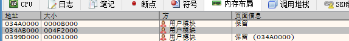
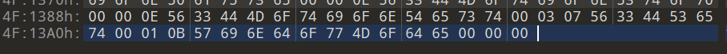
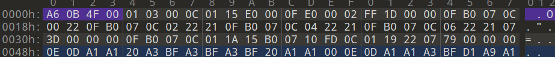

# 星辰恋曲的白色永恒HD——汉化补丁文本移植

本教程仅供交流学习，不提供任何带有xmoe汉化组汉化文本的文件。

写这个文档时，hd版尚未发售，这里假设了hd版的引擎并未作大改动。

20241124

## 需要的工具

python 3.x

x64dbg

任意十六进制编辑器

## 汉化后hcb文件的提取

汉化移植首先得提取出原汉化补丁的文本，得到原文和译文的对应表。

众所周知，fvp的文本存储在hcb格式的虚拟机脚本中，有很多现成的工具可以将其解析为可读的虚拟机汇编代码，从而实现修改文本。

然而，xmoe汉化组的汉化补丁中，并没有修改后的hcb文件，而是进行了压缩 or 加密，需要通过其他的方法来获取。

启动汉化版游戏，用x64dbg附加到进程

从上方选项选到内存布局，找到这样一个大小为0x4f2000的区域：（地址可能会变）



右键点击，选择将内存提取到文件

用任意16进制编辑器打开，找到\xA6\x0B\x4F\x00的位置，将其前面的内容删除；转到文件尾，将末尾的00删除，只保留3个00





这样，目前的文件就是汉化后的hcb文件了。可以将其重命名为snow_chs.hcb。

## hcb的解析

xmoe汉化组开源了一个hcb脚本的解析工具，白永本体可以直接用，但是白永fd疑似没法用，所以我借鉴了大佬的源码，用python重新搓了个。这里就用我自己搓的工具了。

将snow_chs.hcb放到本工具的目录下，在当前目录下运行：

```bat
python hcb_tool.py d snow_chs.hcb 936
```

运行完毕后，目录下会出现snow_chs.txt和snow_chs_string.txt文件，分别为汇编代码以及所有的文本。snow_chs_string.txt仅为调试用，之后不会用到。

同样，将原版生肉的snow.hcb文件也放到hcb_tool.py所在目录下，在当前目录下运行：

```bat
python hcb_tool.py d snow.hcb 932
```

运行完毕后，目录下会出现snow.txt和snow_string.txt文件，能得到游戏的日文文本。

虽然写这个文档时hd版还没发售，但是应该不会有很大差异。对于hd版的hcb文件也同理按上述操作，不再赘述，只需要注意最后一个参数为932。（之后的说明中此文件命名为snow_hd）

## 建立译文字典

接下来的步骤，如果有一定的编程基础，应该很好实现了，不用继续往下看了。这里我也提供了相应的python脚本可以直接使用。在生成了snow.txt和snow_chs.txt后，运行：

```bat
python gen_transdict.py
```

目录下会生成一个transdict.json，里面有原文和译文的对应。

## 导入译文

汉化补丁中，采用了gbk编码进行注入。我技术水平有限，之前制作f社老作的机翻补丁时采用gbk编码注入没成功过，这里就使用了字体替换的方法，通过自己做的一个小工具进行实现。

写这个文档时hd版还没发售，所以代码只是脑测。在生成了snow_hd.txt和transdict.json后运行：

```bat
python injecct_trans.py
```

在release目录下生成了snow_hd_trans.bch文件。适当的重命名，与hd版的hcb文件同名。

由于hd版可能更改了文本，所以可能有部分没有匹配到译文的文本。这部分文本会打印出来，需要自行手动修正。（但是那些地名请勿修正，否则可能会有bug）

## 补丁

补丁所需的文件在release文件夹中。可能需要更改hook.ini中的第二行的游戏原exe名。覆盖到游戏目录即可，无需再转区，无需安装字体，不支持中文目录。
